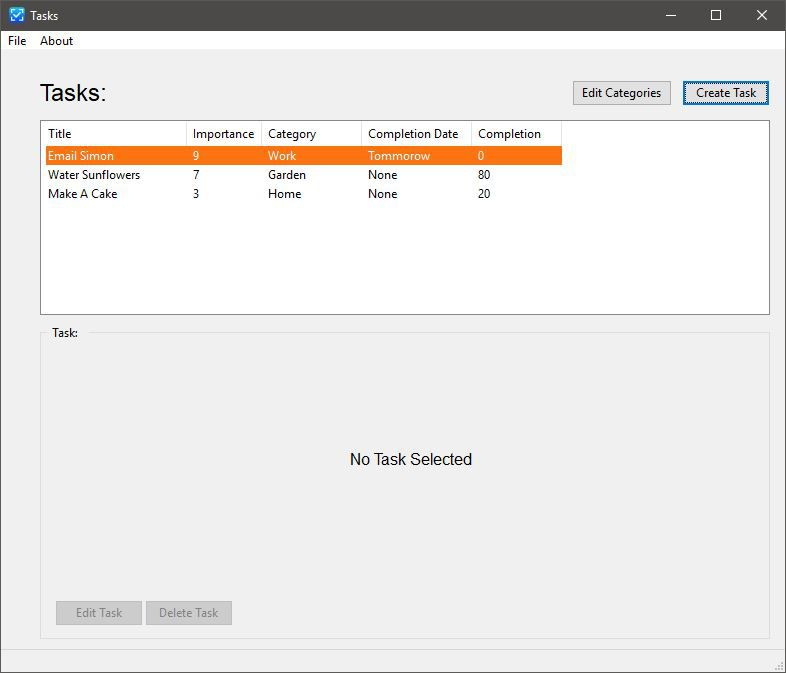
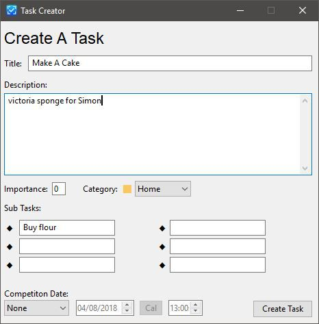
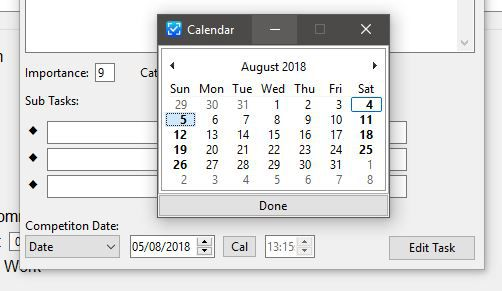
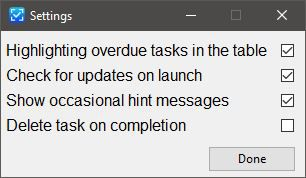
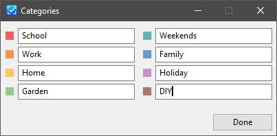

# Tasks

## A windows application for managing tasks

Tasks aims management of tasks easy. It allows for more advanced features such as tagging tasks with custom categories, importance, subtasks and dates while also making it easy to create them. All a tasks need to be present is a title!

### __[DOWNLOAD NOW](https://sourceforge.net/projects/win-tasks/)__

## Features:

* Create and view tasks
* Importance, Description and Subtasks
* Custom colour coded categories
* Option completion date and time
* Calendar control for easy selection for due date
* Sort tasks by any of these values
* Table highlighting for important / overdue / completed task
* Completion percentage
* Update checking
* Edit task values
* Customisable settings

### Possible upcoming features

* Google tasks integration
* Windows notifications for due date
* More...

## Images:

### Creating tasks is easy

 

### Easy set the optional completion date with a calendar

 

### Customisable settings

 

### Customisable colour coded categories 

 

## Other:

### Have Problems? Submit a GitHub issue or contact the developer [@kaleidawave](https://twitter.com/kaleidawave) 

### Want to suggest changes? Complete this [survey](https://docs.google.com/forms/d/e/1FAIpQLSeaUMfuXeK2lIWVBs4CdHx-5ITOob7XRzkuuOWeuLnvvYm-Ww/viewform?usp=sf_link')

### - KALEIDAGRAPH